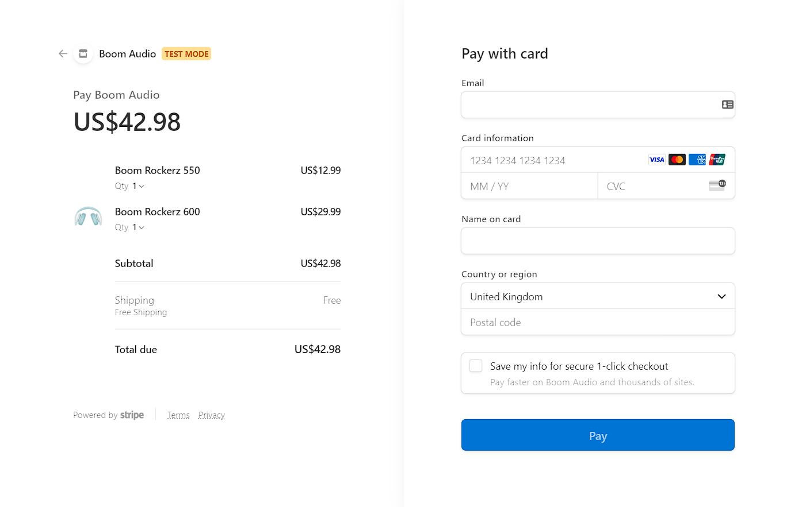

    
# BoomCart

## Demo
#### Live Version :      https://boom-ecomm.vercel.app/

## Table of contents

- [General ](#general-info)
- [Tools and Technologies used](#tools-and-technologies-used)
- [Features](#features)

## General Info

> A Full Stack e-commerce website to purchase audio accessories.
> Utilised React.js, Next.js for the front-end. Employed Sanity.io platform to handle
the back-end, also integrated Stripe-API to handle payments.
 
## Tools and Technologies used

1. <b> React.js </b> :- To build components and to manage the state of the app. 
2. <b> Next.js </b> :- to implement Server-side rendering and Static Generation
3. <b> Sanity.io </b>:- To manage back-end
4. <b> Versel </b> :- For hosting

## Features

### Homepage:-

### Product page:-

### Cart page:-

### Stripe checkout page:-

